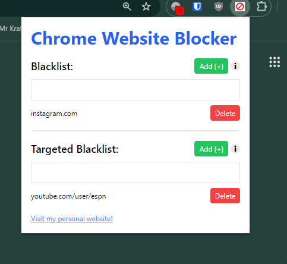
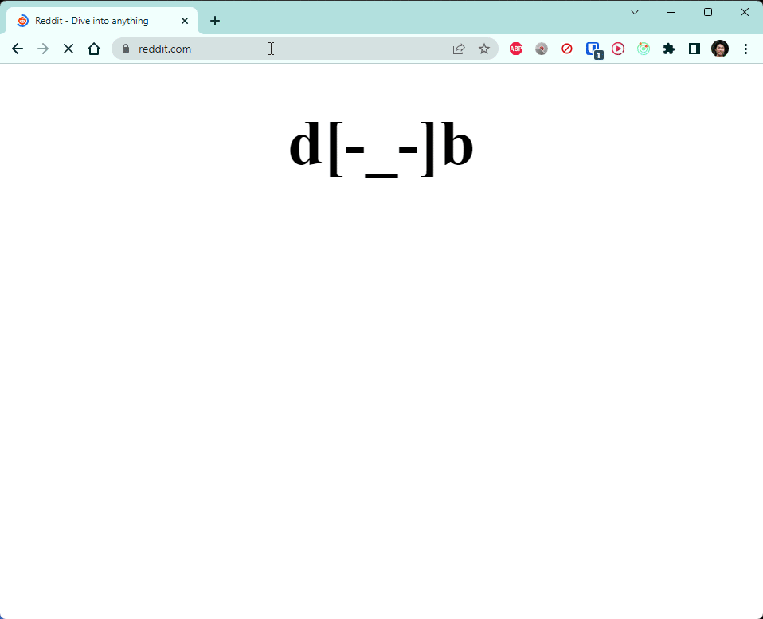

# Chrome Website Blocker
 
This chrome extension allows users to block websites they don't want to see. Website gets turned into ASCII emojis!

Chrome Web Store: [Link](https://chrome.google.com/webstore/detail/chrome-website-blocker/ihopdcjadmlmadilcokagpcmlcbdgekb)

## Preview

How to block websites:



What the website turns into (ex. blocking reddit.com):



## Running Locally

Clone the repo:
```
git clone git@github.com:collindang88/chrome-website-blocker.git
```

Install node modules:
```
npm install
```

Build project:
```
npm run build
```

Then load the `dist` folder into `chrome://extensions/`.